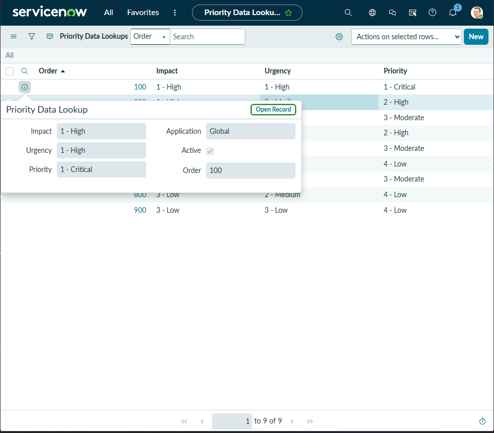
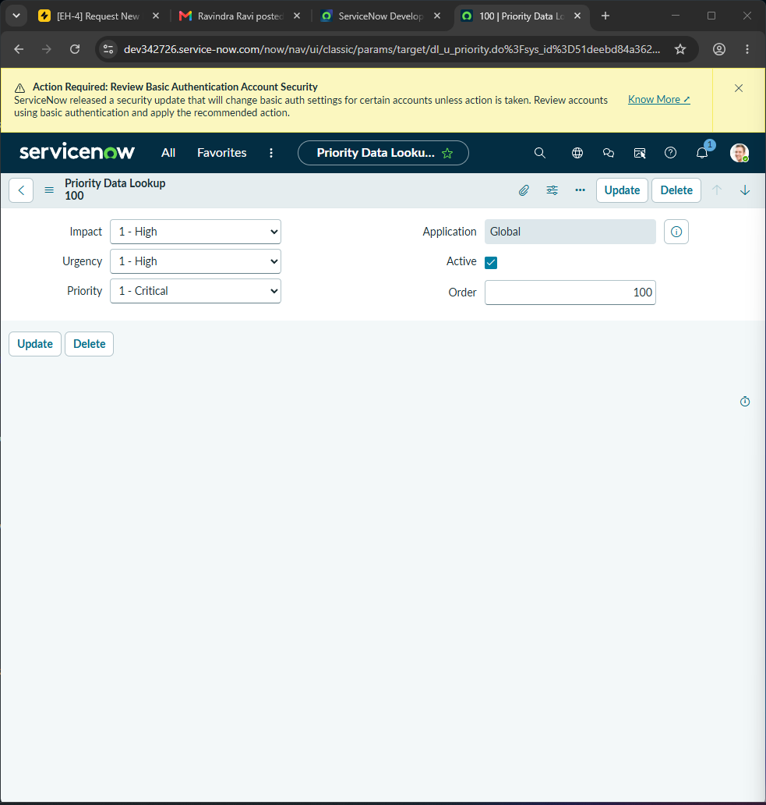
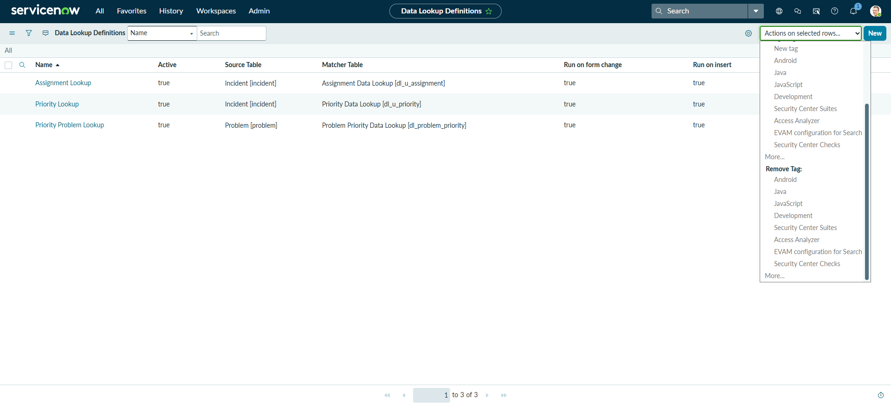
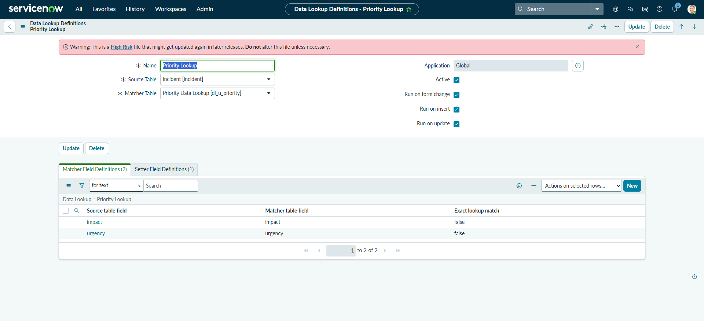
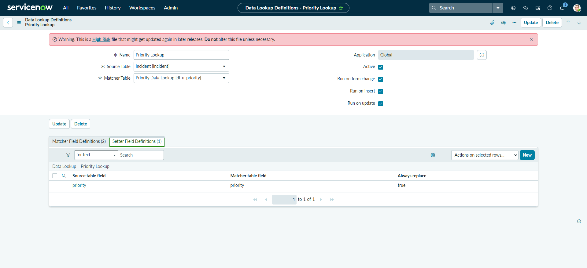

# ServiceNow Data Lookup Lab

## Overview
This lab demonstrates how ServiceNow automatically calculates a ticket's priority level using the built-in Data Lookup Matrix. By evaluating the operational impact and urgency of an incident, the system dynamically assigns the correct priority without manual intervention.

---

## Lab Steps and Process Document

### Step 1: Navigating to Priority Data Lookups
The initial step requires accessing the lookup configuration table. Searching for "Priority Data Lookups" in the filter navigator clears away unrelated modules and brings up the core lookup rules under the System Policy application.

**Priority Lookup Rules Table**

---

### Step 2: Inspecting the P1 Critical Record Form
Opening the specific record for a high-impact, high-urgency scenario reveals how individual rules are stored. The standalone form configuration shows the mapping where an Impact of "1 - High" and an Urgency of "1 - High" explicitly dictates a Priority of "1 - Critical".

**Priority Record Form Layout**

---

### Step 3: Accessing Data Lookup Definitions
To view the underlying technical framework, navigating to "Data Lookup Definitions" reveals the master records controlling these automated actions. This list tracks all active lookup tables running across different processes, including assignment and priority tracking.

**Data Lookup Definitions List**

---

### Step 4: Reviewing the Priority Lookup Rule Setup
Selecting the Priority Lookup record for the Incident table displays the source table and the matcher table connections. The Matcher Field Definitions at the bottom define the input conditions that the platform evaluates.

**Priority Lookup Definition Form**

---

### Step 5: Confirming Setter Field Definitions
The final phase inspects the Setter Field Definitions tab. This view identifies the target field that the system updates automatically once the input conditions from the matcher fields are successfully met.

**Setter Field Definitions Tab**

---

## What I Learned
* **Data Lookup Mechanics**: I learned how ServiceNow decouples data evaluation from hardcoded scripts by utilizing Matcher and Setter tables to evaluate variables dynamically.
* **Priority Calculation Architecture**: I observed firsthand how the intersection of Impact and Urgency determines Priority automatically via backend system properties.
* **Platform Navigation**: I gained experience navigating the administrative backend of a Personal Developer Instance, filtering modules, and inspecting systemic data relationships.
